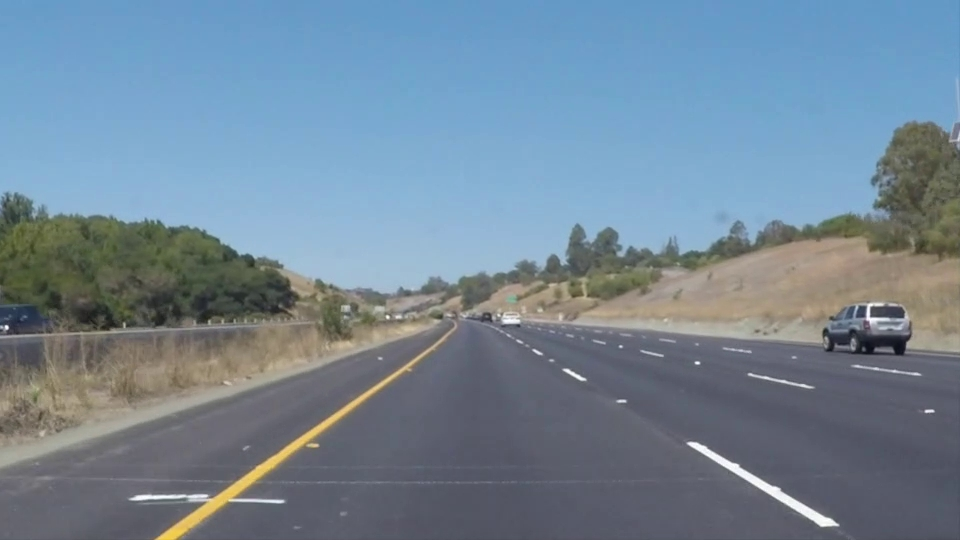
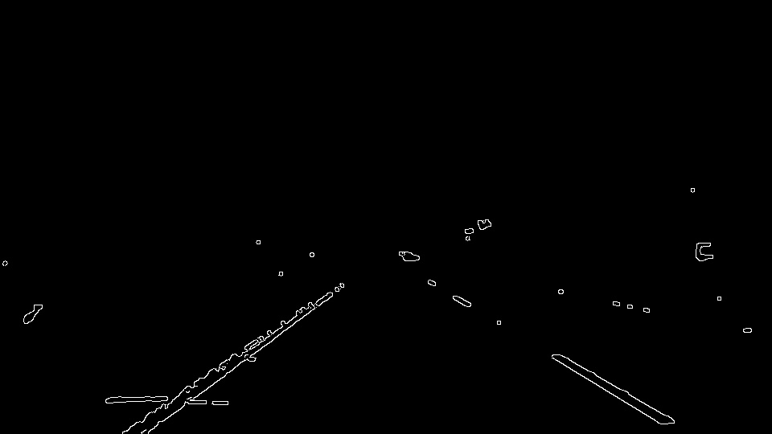
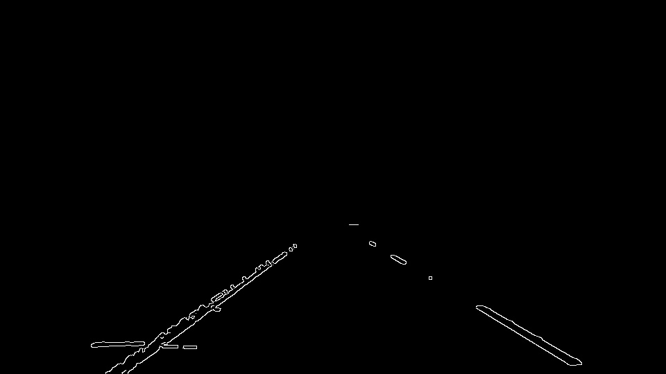
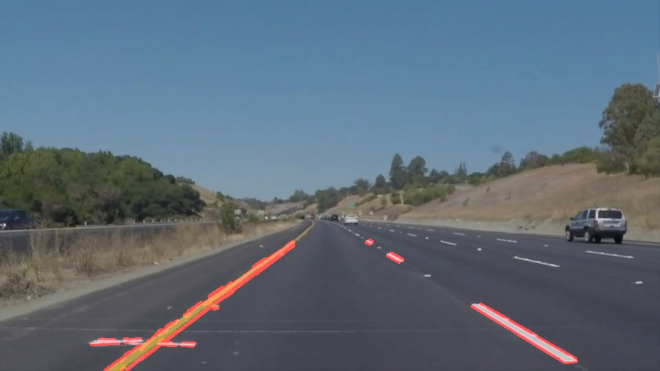
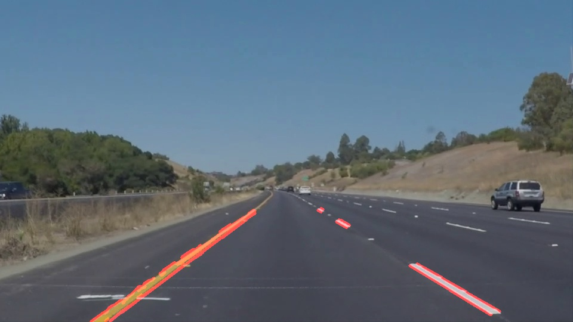
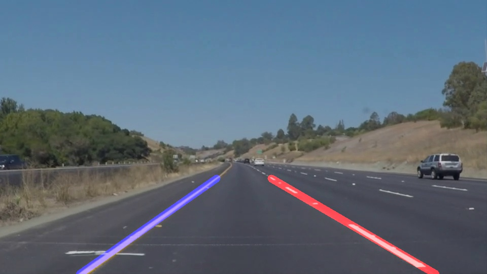

# **Finding Lane Lines on the Road** 

The goals / steps of this project are the following:
* Make a pipeline that finds lane lines on the road
* Reflect on your work in a written report

## Reflection

### Pipeline description

My pipeline consisted of the following steps:

| # | Description | Image |
| --- | --- | --- |
| 1 | Original image. |  |
| 2 | Create and apply the mask to keep only yellow [128,128,0]..[255,255,100] (RGB range) and white [220,220,220]..[255,255,255] pixels. This allows to keep the yellow lines from disappearing on the bright background when converted to grayscale. |  |
| 3 | Convert image to grayscale. |  |
| 4 | Apply Gaussian blur to suppress noise and spurious gradients. | 
| 5 | Apply Canny edge detector. | 
| 6 | Apply the region of interest mask. | 
| 7 | Use the Hough transform to find lines from Canny edges. | 
| 8 | Filter out lines from the Hough transform with slopes not relevant to lane lines we are trying to detect. | 

In order to draw a single line on the left and right lanes, I:
1. Partitioned to left/right the output of filtered Hough transform by horizontal location relative to the center of the image;
1. Fit a 1st-degree polynomial to points in each partition to get the slope/intercept of the fitted line;
1. Took simple moving average of the last 5 slopes/intercepts;
1. Plotted the resulting left and right lines on the input image.

### Potential shortcomings with the pipeline

* Might not work under different light conditions.
* Will not perform great on curved lane marks.
* If lane marks are missing in the multiple frames, will not keep the last values.

### Possible improvements to the pipeline

* Try various color space transformations for difficult light conditions.
* Use higher degree polynomial to fit curved lane marks.
* Handle case when lane marks disappear in multiple consecutive frames by filling the gap with the last values.
